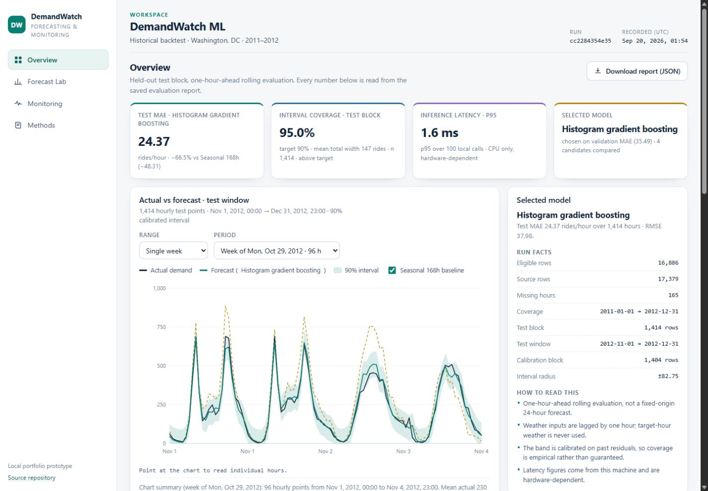
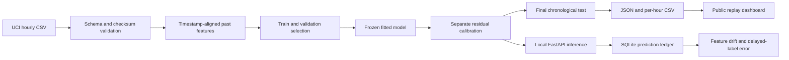

# DemandWatch ML

**Hourly demand forecasting, honest uncertainty, and model monitoring — from raw data to a working API.**

[](https://github.com/BelieveTZ/demandwatch-ml/actions/workflows/ci.yml)
[Open dashboard](https://BelieveTZ.github.io/demandwatch-ml/) · [Measured evaluation](docs/EVALUATION.md) · [中文项目与面试指南](docs/INTERVIEW_ZH.md)

DemandWatch predicts next-hour Capital Bikeshare demand using only calendar information and earlier observations. It compares simple seasonal baselines, Ridge regression and histogram gradient boosting, calibrates an uncertainty interval, and exposes validated inference with delayed-label monitoring.



The public dashboard replays **real saved backtest results**. Fresh predictions run through the local API after training. No API key, GPU, paid service or account is required to reproduce the project.

## Measured results

Frozen November–December 2012 test block, **1,414 eligible hours**, after chronological model selection and a separate calibration period:

| Model | MAE ↓ | RMSE ↓ |
| --- | ---: | ---: |
| Previous day, same hour | 64.27 | 107.36 |
| Previous week, same hour | 72.68 | 118.64 |
| Ridge | 42.51 | 63.81 |
| Histogram gradient boosting | **24.37** | **37.98** |

The selected model reduces MAE by **66.47%** against the previous-week baseline and **62.08%** against the previous-day baseline. Units are hourly rental counts. These are historical backtest results, not a production impact estimate.

The 90% target interval achieves **94.98% empirical coverage**, with mean total width **147.09 rides**. Morning/evening peak coverage is only **87.57% / 87.92%**: a constant residual radius is too broad at quiet hours and too narrow at busy ones. Temporal dependence prevents an ordinary exchangeability-based coverage guarantee. [Full results, slices and limitations](docs/EVALUATION.md).

## Run it

Python 3.12. Windows PowerShell:

```powershell
python -m venv .venv
.\.venv\Scripts\python.exe -m pip install -r requirements.lock
# View the included saved results immediately:
.\.venv\Scripts\python.exe -m demandwatch.cli serve
```

Open [localhost:8787](http://127.0.0.1:8787). Stop the server with Ctrl+C, then prepare live inference:

```powershell
.\.venv\Scripts\python.exe -m demandwatch.cli download
.\.venv\Scripts\python.exe -m demandwatch.cli train
.\.venv\Scripts\python.exe -m demandwatch.cli serve
```

Linux/macOS: use `python3 -m venv .venv` and `.venv/bin/python` in place of the Windows executable. Training is a small CPU job; the first download/install requires internet access. The committed lockfile records the tested environment. See [setup, API examples and Docker](docs/OPERATIONS.md).

## What this demonstrates

- **ML engineering:** timestamp-aligned lags, missing-hour audit, four-block chronological evaluation, baseline comparison and reproducible candidate selection.
- **Uncertainty:** finite-sample residual calibration, empirical interval coverage, and deliberately retained failure slices.
- **MLOps:** data checksum, model/schema/version manifest, artifact integrity check, inference ledger and feedback-based performance monitoring.
- **Serving:** FastAPI schemas, clear unavailable-model behavior, bounded inputs, prediction IDs and SQLite persistence.
- **Product delivery:** responsive dashboard with replay, live what-if inference, distribution-shift inspection and downloadable evaluation evidence.
- **Reproducibility:** unit and real-data integration tests, GitHub Actions, locked dependencies and static GitHub Pages delivery.

## Architecture



Model selection never sees final-test labels. Rolling evaluation can use actual counts from earlier test hours because those would already be observed at the next forecast origin. This is **one-hour-ahead forecasting**, not a 24-hour forecast from a single origin. Weather is from the previous hour; observed target-hour weather and `casual`/`registered` target components are excluded.

## Verify

```powershell
.\.venv\Scripts\python.exe -m pytest -q
.\.venv\Scripts\python.exe -m ruff check demandwatch tests scripts
.\.venv\Scripts\python.exe -m ruff format --check demandwatch tests scripts
node --check demandwatch/web/app.js
```

Download the source first to enable the real-data integration test; without it that test is explicitly skipped. CI downloads the checksum-verified source and runs the full pipeline. The browser verification record is in [docs/VALIDATION.md](docs/VALIDATION.md).

## Scope and data

This is a local portfolio prototype trained on two historical years in one city. It assumes previous-hour labels arrive immediately, excludes incomplete histories, and has not been validated on today's system or another city. PSI is a heuristic distribution-change indicator, not proof of accuracy degradation. Synthetic stress tests are labeled as such. The local API has no authentication and binds to loopback; only the static replay is publicly hosted.

Dataset: Fanaee-T, H. (2013). *Bike Sharing*. UCI Machine Learning Repository, [DOI 10.24432/C5W894](https://doi.org/10.24432/C5W894), **CC BY 4.0**. Actual parsed file: 17,379 rows; the UCI landing-page count differs. [Data attribution](DATA_LICENSE.md), [source/method research](docs/RESEARCH.md), [model card](docs/MODEL_CARD.md).

Code is MIT licensed. The data and derived replay records retain their separate CC BY 4.0 attribution.
